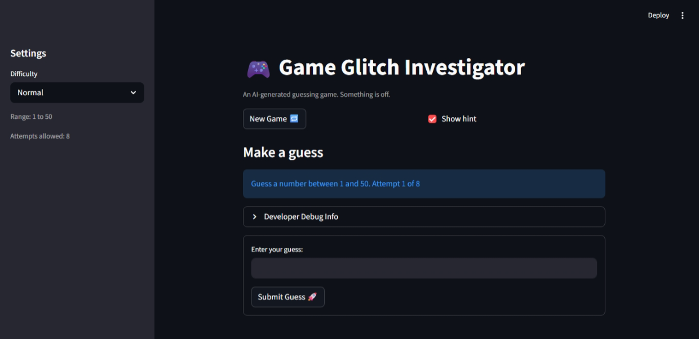

# 🎮 Game Glitch Investigator: The Impossible Guesser

## 🚨 The Situation

You asked an AI to build a simple "Number Guessing Game" using Streamlit.
It wrote the code, ran away, and now the game is unplayable. 

- You can't win.
- The hints lie to you.
- The secret number seems to have commitment issues.

## 🛠️ Setup

1. Install dependencies: `pip install -r requirements.txt`
2. Run the broken app: `python -m streamlit run app.py`

## 🕵️‍♂️ Your Mission

1. **Play the game.** Open the "Developer Debug Info" tab in the app to see the secret number. Try to win.
2. **Find the State Bug.** Why does the secret number change every time you click "Submit"? Ask ChatGPT: *"How do I keep a variable from resetting in Streamlit when I click a button?"*
3. **Fix the Logic.** The hints ("Higher/Lower") are wrong. Fix them.
4. **Refactor & Test.** - Move the logic into `logic_utils.py`.
   - Run `pytest` in your terminal.
   - Keep fixing until all tests pass!

## 📸 Demo

[Insert screenshot of your fixed, winning game here]

## Demo

This project is a Streamlit-based number guessing game where users select a difficulty level and try to guess a randomly generated number within a limited number of attempts.

### How to Run
```bash
pip install -r requirements.txt
python -m streamlit run app.py

Gameplay Overview

Choose a difficulty (Easy, Normal, Hard)

Each difficulty has a different number range and attempt limit

Enter guesses and receive feedback (too high / too low)

The game ends when you guess correctly or run out of attempts


